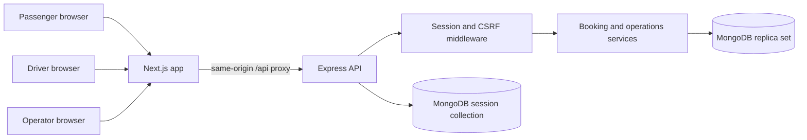
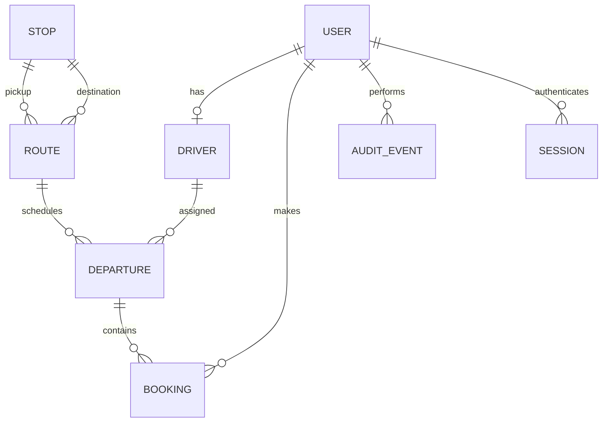
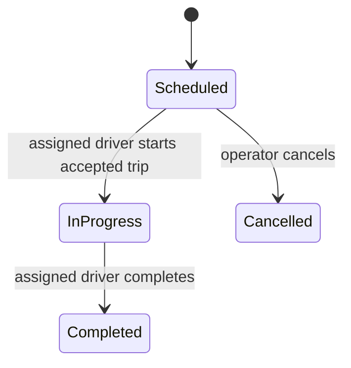

# Architecture and system design

## Service boundary

This is a modular monolith, not a set of microservices. Two processes separate interface rendering from business rules without introducing a distributed booking transaction. Browser requests use one public origin. `apps/web/app/api/[...path]/route.ts` forwards a fixed, configured upstream URL at runtime; clients cannot supply another host. It forwards necessary cookies, Origin and CSRF headers, bounds request bodies to 16 KiB, limits upstream waiting and returns a usable error when the API is unavailable.

The API should be private to the web service in production. Next.js supplies the configured public protocol to Express; production API `TRUST_PROXY=1` is safe only when network access ensures this proxy is the trusted caller. It deliberately does not accept arbitrary client-supplied forwarded IP addresses. Consequently the built-in login limiter can aggregate users behind the proxy. Add a trusted edge rate limit before a larger rollout.

## Modules

Controllers translate HTTP into validated commands and response DTOs. Domain functions own money, ownership, capacity and state transitions. Mongoose models own database shapes and indexes. Serializers expose public record shapes and join route/driver information. Contracts are shared TypeScript/Zod data definitions, not permission logic.

The frontend uses TanStack Query for fetching, retrying reads, caching and invalidating affected screens. Mutations do not automatically retry. Booking retries use a stable key. Polling is limited to the active working views and stops when the browser is hidden through TanStack Query defaults. Polling uses 15/20/30-second intervals; it is not continuous vehicle tracking.

## Entity relationships

References are IDs stored as strings in documents, with explicit existence and ownership checks. MongoDB does not enforce foreign keys for us. Historical route, fare, passenger-name and contact snapshots preserve booking meaning when configuration changes.

Currency is integer paise: ₹25 is 2500; two seats cost 5000. UTC instants are stored as dates, and the UI displays Asia/Kolkata. An IST datetime from the operator is explicitly converted using `+05:30`, avoiding reliance on the host computer's timezone.

## Booking transaction

A successful request requires a scheduled departure, future time, pending/accepted assigned driver, enough seats and a unique request key for that passenger.

Inside one MongoDB transaction:

1. Check `(passengerId, idempotencyKey)` for a prior result.
2. For a replay, verify departure, seat count and contact phone match and return the original booking.
3. Conditionally decrement `availableSeats` and increment the departure version.
4. Insert a booking with the authoritative fare snapshot and contact snapshot.
5. Insert an audit event.
6. Commit before returning confirmation.

A failed insert rolls back the seat change. A driver decline, trip start or cancellation writes the same departure, so concurrent operations conflict rather than observing inconsistent states. The MongoDB driver's transaction helper retries transient conflicts; duplicate unique-index races receive a bounded retry outside the transaction.

Cancellation checks passenger ownership and cutoff, rejects a paid booking, restores seats and changes booking state in one transaction. Repeating an already successful cancellation returns the same cancelled booking without adding seats again.

Indexes enforce unique emails, booking references and passenger/request-key pairs. Query indexes cover route/time, driver/time, passenger history, departure manifests and audit history. Session expiry uses a TTL index; TTL cleanup is asynchronous and not a precise wall-clock deletion guarantee.

## Driver scheduling and lifecycle

A per-driver `scheduleVersion` update is a transactional scheduling guard. Each assignment writes this driver record before checking interval overlap, causing concurrent assignments for the same driver to serialise. Two reads without this write would both see an empty schedule and could both insert conflicting assignments.

Intervals are half-open: a trip ending at 10:00 does not conflict with one scheduled to begin at 10:00. Early start is allowed within 15 minutes, but the guard also checks for any other in-progress trip, regardless of its expected end. Thus adjacent or overrunning trips cannot be operated simultaneously.

Assignment transitions are unassigned → pending → accepted/declined. Declined trips can be reassigned. Reassignment is prohibited after start. Eligibility removal is blocked while a driver has an in-progress trip or an upcoming pending/accepted assignment; an estimated end time cannot make an ongoing trip disappear.

Booking transitions: confirmed → completed, passenger-cancelled, departure-cancelled or no-show. Cash collection is separate from lifecycle. Recording cash twice does not duplicate revenue because each booking has one boolean collection state and one amount. A no-show can only be recorded by the assigned driver after start, cannot be applied to a collected booking and creates no penalty or debt. No-show bookings remain visible in the manifest and history.

Departures with recorded cash cannot be cancelled by the simple cancellation path because there is no refund module. Resolve the actual cash situation operationally; do not pretend a database status reverses payment.

## Permissions and sessions

Public registration can only create passengers; strict request schemas reject unknown `role` or fare fields. Operators provision driver accounts through a protected API. Operators themselves are provisioned through the administrative CLI.

Login verifies an Argon2id hash, regenerates the session ID and stores only the authenticated user ID and CSRF token in server-side session data. Each private request loads current user eligibility and uses the stored role, never a submitted role. Resource checks scope passenger bookings to their owner and manifests to the assigned driver.

The session cookie is HttpOnly, SameSite=Lax and Secure in production. State-changing requests require both an exact configured Origin and a valid session-bound CSRF token. A malicious site cannot obtain the token through normal same-origin browser protections. There is no JWT stored in localStorage.

## Growth path and tradeoffs

For a single cluster, one API and a replica set are sufficient. Scaling requires evidence first:

- More API replicas: use an edge or shared limiter; MongoDB session storage already supports shared sessions.
- More frequent live updates: replace polling with SSE/WebSockets while retaining server domain rules.
- Larger timetables: filtered pagination already exists; add searchable route/date filters and review query plans.
- Larger reads: serializers currently join records with queries per item. Lists are bounded, but aggregation/batched lookups are the first database-read optimisation.
- Notifications: persist an outbox event in the booking transaction, then deliver messages from a worker. Do not send SMS inside a retried transaction.
- Multiple regions: partition operating areas; do not introduce global driver scheduling prematurely.

MongoDB was selected for the user's backend-learning goal. PostgreSQL would offer natural foreign keys and relational queries, but still needs correct transactional capacity and idempotency rules. Changing databases does not eliminate domain concurrency design.

## Deliberate limits

Operator summary panels contain bounded recent samples for bookings/audit/reference lists; aggregate counters query the full collections. Driver and operator actionable departure lists have separate filtered pagination and cannot be hidden behind a 100-record future/history sample. The current app does not implement dynamic dispatch, reservations without an assigned driver, emergency monitoring, automatic refunds or online payments.
